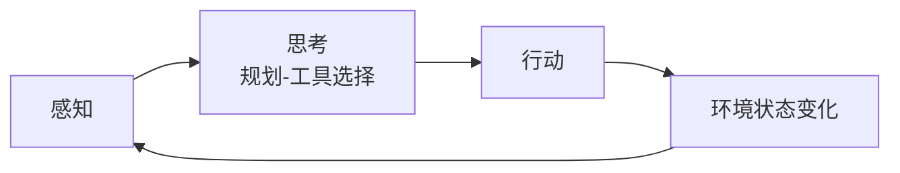

## 学习内容

> [!note] 核心概念、原理、知识点

### 智能体运行机制

智能体并非为一次性任务，是一个与环境交互的循环，名为**智能体循环**（AgentLoop）：**感知 → 思考（规划-工具选择）→ 行动**。其中行动并非循环终点，智能体的行动最终会影响环境的**状态变化**，环境随即产生一个新的**观察**作为下一次循环的输入。通过该循环从最初的初始化状态向**目标状态**演进。



### 智能体的感知和行动

为了让 LLM 能够有效驱动这个循环，我们需要一套明确的**交互协议**（Interaction Protocol）来规范它和环境的信息交换。

智能体输出不再是单一的自然语言回复，而是遵循一定结构化的格式文本，其中明确了推理过程和最终决策：

```text
Thought: 用户想知道北京的天气。我需要调用天气查询工具。
Action: get_weather("北京")
```

Action 执行外部工具后，可能会返回原始的机器可读数据（如 JSON），通常包含 LLM 无需关注的冗余信息，不符合自然语言处理习惯。这时候需要一个**感知系统**，将其处理并封装成一段简洁、清晰的自然语言文本，即**观察**：

```text
Observation: 北京当前天气为晴，气温25摄氏度，微风
```

这段 `Observation` 文本会被反馈给智能体，作为下一轮循环的主要输入信息，供其进行新一轮的 `Thought` 和 `Action`。

> [!summary] 总结
> 通过这个由 **Thought → Action → Observation** 构成的严谨循环，LLM 智能体得以将内部的语言推理能力，与外部环境的真实信息和工具操作能力有效地结合起来。

## 实践记录

> [!tip] 代码片段、实验过程、踩坑经验

### 流程概览

![[agent-loop-sequence.excalidraw|600]]

### 详细日志

下方是一段相对完整的 **Agent Loop** 循环过程案例的输出。

```text
用户输入: 你好，请帮我查询一下今天南京的天气，然后根据天气推荐一个合适的旅游景点。
========================================
--- 循环 1 ---

正在调用大语言模型...
大语言模型响应成功。
模型输出:
Thought: 我需要先查询南京今天的天气，然后根据天气情况推荐合适的旅游景点。
Action: get_weather(city="南京")

Observation: 南京当前天气:Sunny，气温19摄氏度
========================================
--- 循环 2 ---

正在调用大语言模型...
大语言模型响应成功。
模型输出:
Thought: 已获取南京今天的天气为晴天，气温19摄氏度。接下来将根据这一天气情况推荐合适的旅游景点。
Action: get_attraction(city="南京", weather="Sunny")

Observation: Under sunny weather, visit Zhongshan Mountain for scenic views, Nanjing Presidential Palace for history, and Qinhuai River for cultural experiences.
========================================
--- 循环 3 ---

正在调用大语言模型...
大语言模型响应成功。
模型输出:
Thought: 已获取南京在晴天时的推荐景点，包括中山陵、南京总统府和秦淮河。现在可以向用户给出完整的回答。
Action: Finish[今天南京天气晴朗，气温19摄氏度，适合出游。推荐您前往中山陵欣赏自然风光，或参观南京总统府了解历史文化，也可以漫步秦淮河畔体验独特的文化氛围。]

任务完成，最终答案: 今天南京天气晴朗，气温19摄氏度，适合出游。推荐您前往中山陵欣赏自然风光，或参观南京总统府了解历史文化，也可以漫步秦淮河畔体验独特的文化氛围。
```
